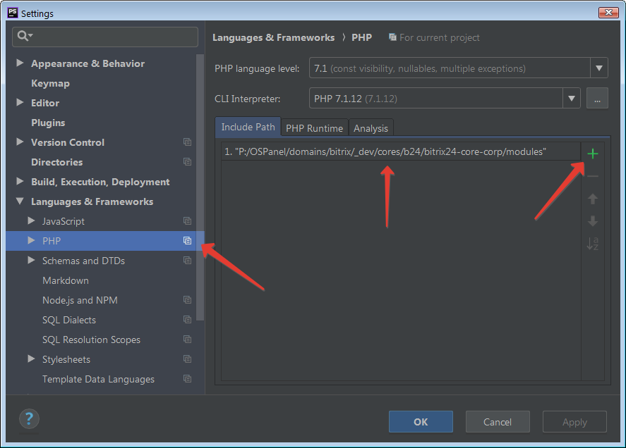

# Ядро "1С-Битрикс24" Корпоративный портал

* Кодировка: UTF-8

## История версий

* 20.0.700 (18.03.2020)
* 20.0.000 (06.11.2019)
* 18.5.180 (16.05.2019)

## Для чего нужен данный репозиторий

* Отследить изменения в релизах "1С-Битрикс24" Корпоративный портал:
    * Т.е., в каком релизе добавился тот или иной модуль, какие изменения в нём произошли.

* Для быстрой корректировки проекта, например, на сервере, без необходимости скачивания или установки всего проекта:
    * Каталог /modules/ - 20.0.700 (18.03.2020) - содержит 76954 файлов
    * Просто добавляем в индексацию IDE и всё.    

* Быстрое индексирование проекта PHPStorm при повторном подключении:
    * Т.е. достаточно подключать только данный каталог, без необходимости повторной индексации всей папки /bitrix/ (содержит более 125 тыс. файлов) на каждом проекте. Особенно актуально для медленных ПК без SSD;
    * Просто, храните данный репозиторий в одном постоянном месте, а проекты, где будет удобно.    

* Вы всегда можете оперативно переключиться на нужную доступную версию ядра. 
    
## Подключение в PHPStorm

* 'Меню' > 'File' > 'Settings' > 'Languages & Frameworks' > 'PHP' > 'Include Path' > '+' > 'Путь к каталогу modules'
    

    
## Полезные ссылки

* [Ядро "1С-Битрикс: Управление сайтом" Бизнес. Каталог /modules/](https://github.com/avshatalov48/bitrix-core-business/)
* [Комплексный компонент для работы с элементами Highload-блоков Битрикс](https://github.com/avshatalov48/highloadblock.complex/)
* [Скачать "1C-Битрикс24"](https://www.1c-bitrix.ru/download/intranet.php)
* [Регистрация пробных версий продуктов и решений «1С-Битрикс»](https://www.1c-bitrix.ru/bsm_register.php)
* [bxApiDocs](https://github.com/matiaspub/bxApiDocs/)
* [bxApiDocs-1](https://github.com/nordeveloper/bxApiDocs-1/)